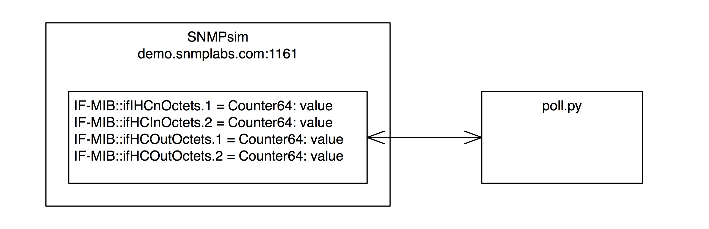

## SNMP interface poller
Simple code to poll two interface input/output byte counts and 
display bytes/second and total bytes for each.



### Invocation:  

```
usage: python poll.py [-h] [--router ROUTER] [--port PORT] [--interval INTERVAL]
               [--community COMMUNITY] [--iterations ITERATIONS]

optional arguments:
  -h, --help               show this help message and exit
  --router ROUTER          router name to query (default: demo.snmplabs.com)
  --port PORT              router SNMP port (default: 1161)
  --interval INTERVAL      polling interval seconds, positive integer (default: 1)
  --community COMMUNITY    SNMP community string (default: public)
  --iterations ITERATIONS  Number of polls to execute, positive integer or 0 (forever) (default: 1)
```

### requirements.txt
Tested with Python 3.6.1 and requires:
```
ply==3.10
pyasn1==0.3.2
pycryptodome==3.4.6
pysmi==0.1.3
pysnmp==4.3.9
```
All of which may be installed with ```pip install pysnmp```.
